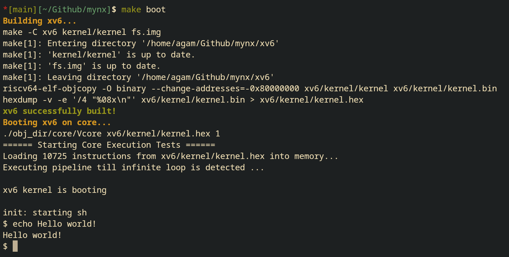

# mynx
> **⚠️ WORK IN PROGRESS:** This project is actively under development. Features may be missing, broken, or change drastically without notice.

Extensible RISC-V core with xv6 on PYNQ Z2 FPGA board.

> AI Usage Note: You may see usage of AI in tests or verify scripts but most code in core/ folder is human written. Dont let the alignments throw you off I kinda like those.

### BIG TODOS!
- add PMP support
- add mmio support 
- clean up tests, its a mess rn


## Prerequisites

* **Verilator:** Verilog simulation
* **RISC-V GNU Toolchain:** `riscv64-elf-gcc` for bare-metal tests and kernel compilation
* **Python 3:** running automated verification scripts
* **Spike** (`riscv-isa-sim`): reference simulator for test verification
* **Make:** build system

## Usage and Testing
Compile the Verilog source files into the `Vcore` executable:
```bash
make build-core
```

You can compile and run specific tests by passing the `TEST` variable (without the extension).

For Assembly Tests: (`tests/asm/*.s`)
```bash
make run-asm TEST=add
```
For C Tests: (`tests/c/*.c`)
```bash
make run-c TEST=io
```
For Official RISC-V Test Suite: (`tests/riscv/asm/*.S`)
```bash
make run-riscv TEST=addi
```

> Note: If you just want to run an arbitrary `.hex` file without using the predefined directories, use the generic run target:
> ```bash
> make run FILE=path/to/your/program.hex
> ```
> `.hex` files are supposed to contain instructions line by line in text format (not binary).

## Verification
The testbench can automatically compare the register state and memory dump of the core against the official Spike simulator using the `verify.py` script.

Verify a single test:
```bash
make verify-asm TEST=add
make verify-c TEST=simple
make verify-riscv TEST=addi
```

Verify an entire test suite at once:
```bash
make verify-asm-all
make verify-c-all
make verify-riscv-all
```
> NOTE: C test verification may fail or hang as a result of Spike not having MMIO set up.

## Booting xv6
To compile xv6, extract its binary, and boot it directly on the core:
```bash
make boot
```

> NOTE: This automatically builds the kernel behind the scenes if xv6 has been modified.

## Adding New Tests
1. **Assembly:** Drop your `.s` files into `tests/asm/`. Make sure you have `_start` entry label in your asm file. 
2. **C Code:** Drop your `.c` files into `tests/c/`. The `Makefile` will automatically link it against the custom runtime (`crt0.S`, `softmath.c`, `trapvec.S`). Make sure you have `trap_handler` defined as a function (leave it empty if you want but it wont compile if its not defined),
```c
void trap_handler() {...}
```

> NOTE: All the programs are loaded at address `0x80000000` in memory, so please maintain that addressing.